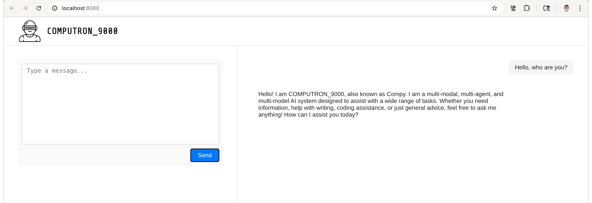

# COMPUTRON_9000
I am COMPUTRON_9000.


## Features
- Modern, responsive chat UI (ChatGPT style)
- System prompt for consistent assistant behavior
- Python proxy server for CORS and API routing
- Easy setup with [uv](https://github.com/astral-sh/uv) and `pyproject.toml`

## Requirements
- Python 3.11.12 (see `.python-version`)
- [uv](https://github.com/astral-sh/uv) (for dependency and venv management)
- Ollama running locally (default: `http://localhost:11434`)

## Setup

1. **Clone the repo:**
   ```sh
   git clone <this-repo-url>
   cd chat_app
   ```

2. **Create a virtual environment:**
   ```sh
   uv venv .venv
   ```

3. **Activate the virtual environment:**
   - On Unix/macOS:
     ```sh
     source .venv/bin/activate
     ```
   - On Windows:
     ```sh
     .venv\Scripts\activate
     ```

4. **Install dependencies:**
   ```sh
   uv pip install -r pyproject.toml
   ```

5. **Start the proxy server:**
   ```sh
   uv run main.py
   ```

6. **Open the chat UI:**
   - Visit [http://localhost:8080](http://localhost:8080) in your browser.

## Usage
- Type your message and press Enter or click Send.

